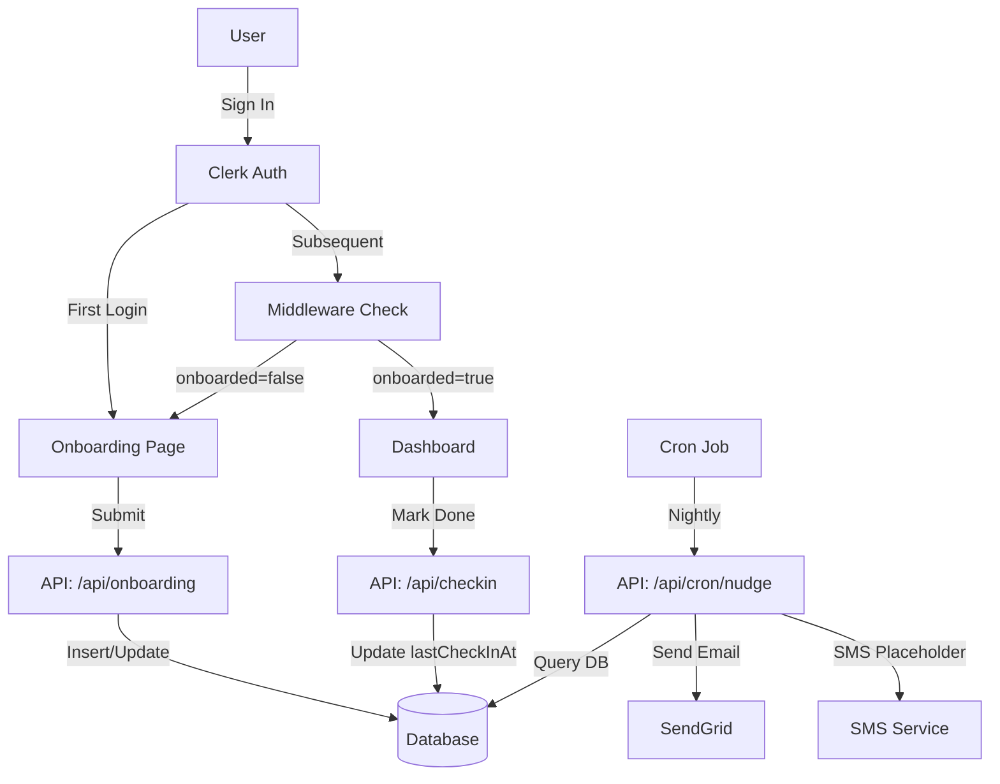

# 2026 Goals Account

ability App Implementation Plan

## Architecture Overview




## Implementation Steps

### 1. Database Schema Updates

Update [db/schema.ts](db/schema.ts) to replace existing tables with:

- `users` table with fields:
- `clerkId` (text, unique, not null) - Clerk user ID
- `goal` (text, 10-200 chars) - User's 2026 goal
- `accountabilityBuddyEmail` (text, optional)
- `accountabilityBuddyPhone` (text, optional)
- `reminderCadence` (text: 'daily' | 'weekly' | null)
- `onboarded` (boolean, default false)
- `lastCheckInAt` (timestamp, nullable)
- `streak` (integer, default 0) - consecutive check-in days
- `createdAt`, `updatedAt` timestamps

### 2. Dependencies

Add to [package.json](package.json):

- `@sendgrid/mail` - For email notifications
- `zod` - For form validation

### 3. Clerk Setup

- **Update [app/layout.tsx](app/layout.tsx)**: Wrap with `ClerkProvider`
- **Create/Update [middleware.ts](middleware.ts)**: 
- Add route protection logic:
    - Protect all routes except public ones
    - Check `onboarded` status from database
    - Redirect `/dashboard` → `/onboarding` if `onboarded = false`
    - Redirect `/onboarding` → `/dashboard` if `onboarded = true` (prevent re-onboarding)

### 4. Onboarding Page

Create [app/onboarding/page.tsx](app/onboarding/page.tsx):

- Form with:
- Goal textarea (10-200 chars, required)
- Accountability buddy email (optional)
- Accountability buddy phone (optional)
- Reminder cadence select (daily/weekly/none, optional)
- Client-side validation with Zod
- Submit to `/api/onboarding`

Create [app/api/onboarding/route.ts](app/api/onboarding/route.ts):

- Get authenticated user from Clerk
- Validate form data
- Insert or update user in database:
- Use `clerkId` as unique identifier
- Set `onboarded = true`
- Redirect to `/dashboard` on success

### 5. Dashboard Page

Create [app/dashboard/page.tsx](app/dashboard/page.tsx):

- Fetch user data from database (goal, streak, lastCheckInAt)
- Display:
- User's goal prominently
- Current streak count
- Last check-in date/time
- Large "Mark Done" button
- Handle check-in via `/api/checkin`

Create [app/api/checkin/route.ts](app/api/checkin/route.ts):

- Get authenticated user from Clerk
- Update user record:
- Set `lastCheckInAt = now()`
- Calculate and update `streak`:
    - If last check-in was yesterday: increment streak
    - If last check-in was today: no change
    - Otherwise: reset streak to 1
- Return success response

### 6. Cron Job API Route

Create [app/api/cron/nudge/route.ts](app/api/cron/nudge/route.ts):

- Add authentication (API key or secret header to prevent public access)
- Query users where:
- `onboarded = true`
- `accountabilityBuddyEmail IS NOT NULL OR accountabilityBuddyPhone IS NOT NULL`
- `lastCheckInAt < now() - reminderCadence` (daily = 1 day, weekly = 7 days)
- For each user needing a nudge:
- Send email via SendGrid to `accountabilityBuddyEmail`
- Email template: "Your accountability buddy hasn't checked in since [date]"
- SMS placeholder: Log/comment for future SMS implementation
- Return summary of nudges sent

### 7. Environment Variables

Create `.env.example` with:

- `NEXT_PUBLIC_CLERK_PUBLISHABLE_KEY`
- `CLERK_SECRET_KEY`
- `DATABASE_URL`
- `SENDGRID_API_KEY`
- `CRON_SECRET` (for securing cron endpoint)

### 8. Homepage Redirect

Update [app/page.tsx](app/page.tsx):

- Redirect authenticated users to `/dashboard` or `/onboarding` based on status
- Show sign-in for unauthenticated users

### 9. Database Migration

Generate and run migration:

- `drizzle-kit generate` to create migration
- Update existing migration or create new one

## File Structure

```javascript
app/
  ├── layout.tsx (add ClerkProvider)
  ├── page.tsx (homepage redirect)
  ├── onboarding/
  │   └── page.tsx (onboarding form)
  ├── dashboard/
  │   └── page.tsx (main dashboard)
  └── api/
      ├── onboarding/
      │   └── route.ts
      ├── checkin/
      │   └── route.ts
      └── cron/
          └── nudge/
              └── route.ts
db/
  └── schema.ts (update users table)
middleware.ts (rename from proxy.ts, add onboarding check)
```